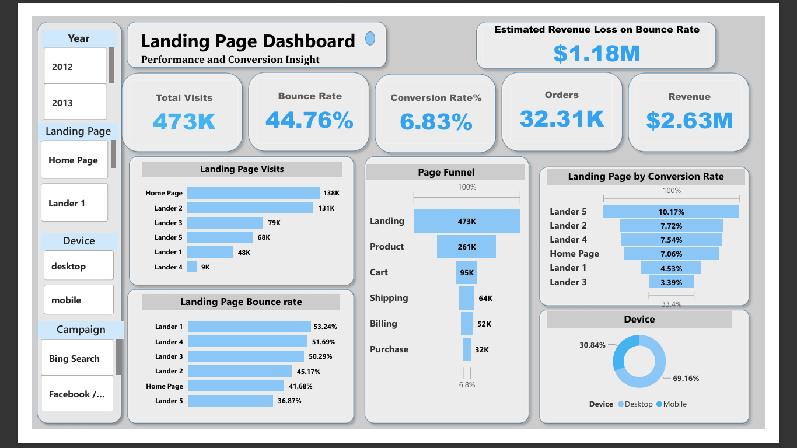
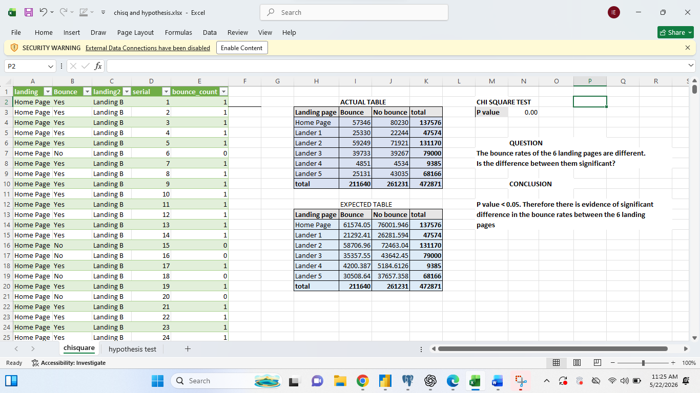
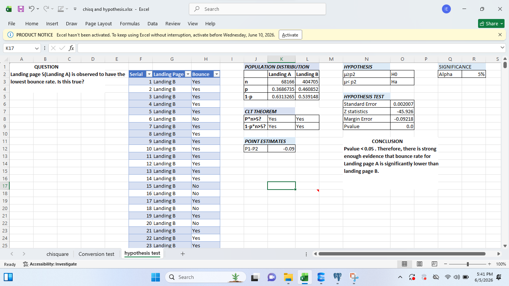
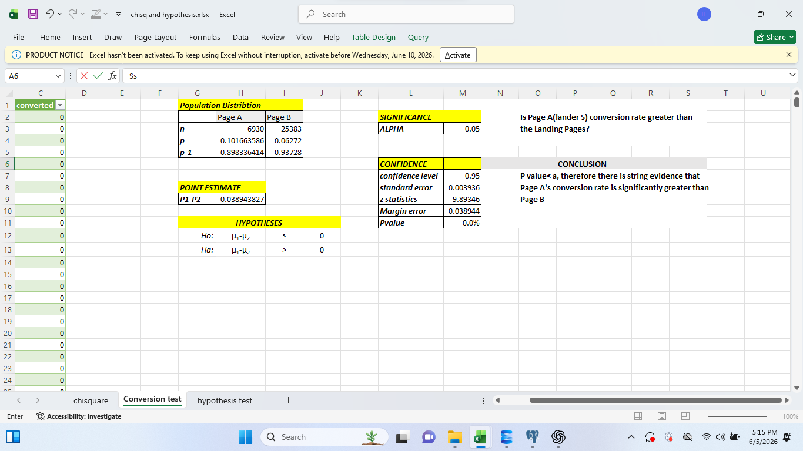

# Landing Page Performance Analysis

Landing page performance analysis using SQL, Excel, and Power BI to identify conversion drivers, bounce rate issues, and revenue optimization opportunities.

---

# Data Analytics Portfolio

**Ike Emeka Ernest**  
Aspiring Data Analyst | Excel • SQL • Power BI • Python (Learning)

---

## About Me
I am an aspiring Data Analyst focused on transforming raw data into actionable business insights that improve revenue, user experience, and decision-making.

### Core Skills
- Excel: Data inspection, validation, exploratory analysis  
- SQL: Data cleaning, joins, CTEs, window functions, transformation  
- Power BI: Dashboards, KPI creation, Funnel & Cohort Analysis  
- Business Analytics: Conversion optimization, ROI analysis  
- Python: Currently learning (automation & ETL focus)

---

# Project 1: Landing Page Performance Analysis

**Live Assets**:  
[Project 1 Folder (Dashboards, Excel, PDFs, SQL)](https://drive.google.com/drive/folders/1dTU5CpzmJBNrTkHeOSnLvu6AkfCnlwlp?usp=drive_link)

---

## Business Problem
An e-commerce platform experienced inconsistent performance across multiple landing pages, resulting in high bounce rates and lost revenue opportunities.

---

## Tools Used
- **SQL** → Data cleaning, transformation, joins, aggregation  
- **Excel** → Data inspection and validation across multiple joined tables  
- **Power BI** → Dashboard development and KPI visualization  

---

## Data Preparation & Analysis Approach
- Cleaned and transformed raw data using SQL:
  - Removed duplicates
  - Handled missing values
  - Joined multiple raw tables into unified dataset
- Used Excel for data inspection and validation
- Built Power BI dashboard for performance tracking
- Segmented data by:
  - Landing pages (Home Page, Lander 1–5)
  - Device type (Mobile vs Desktop)
  - Traffic sources (Bing, Facebook, Social)
- Conducted statistical analysis:
  - Chi-Square test for landing page differences
  - Hypothesis testing for conversion and bounce rates

---

## SQL Data Pipeline Design

This project uses a structured SQL workflow split into two layers:

### 1. Data Preparation Layer (ETL for Excel Analysis)
- Data cleaning and transformation
- Joining multiple raw tables
- Creating calculated fields for statistical testing
- Aggregating data for Excel-based validation

Used for:
- Chi-Square tests
- Hypothesis testing
- Statistical validation

---

### 2. BI Reporting Layer (Power BI + DAX)
- KPI aggregation for dashboards
- Conversion rate calculations
- Bounce rate metrics
- Data modeling for reporting layer

Used in Power BI for:
- Dynamic KPI calculations
- Landing page comparisons
- Interactive dashboards

---

## Sample SQL Query (Reporting Layer)

```sql
view_number as (
    select 
        h.website_session_id,
        btrim(regexp_replace(h.pageview_url,'[^a-zA-Z0-9]',' ','g')) as landing_page,
        count(wp.*) as viewed
    from homepage as h
    inner join website_pageviews wp
        on h.website_session_id = wp.website_session_id
    group by 1,2
)

select 
    case 
        when landing_page in ('home','lander 1','lander 2','lander 3','lander 4') 
        then 'Landing B' 
        else 'Landing A'
    end as landing_page,
    
    case 
        when viewed = 1 then 'Yes' 
        else 'No' 
        ```

---

        ## SQL Scripts & Project Files

### View Full SQL Scripts
- [Excel Statistical Prep SQL](sql/LandingPageAnalysis.sql)
- [Power BI Reporting SQL](sql/Landing-page-psql.sql)

---

## Data Preparation & Analysis Approach

This project followed a structured analytics workflow combining SQL, Excel, and Power BI.

### 1. Data Engineering (SQL Layer)
- Performed data cleaning and transformation using SQL:
  - Removed duplicates
  - Handled missing values
  - Joined multiple raw tables into a unified dataset
  - Created calculated fields using SQL aggregations and transformations

### 2. Data Validation (Excel Layer)
- Used Excel to inspect and validate multiple joined tables
- Verified correctness of transformed datasets before analysis

### 3. BI & Visualization Layer (Power BI)
- Built an interactive landing page performance dashboard
- Created KPIs and performance visuals

### 4. Segmentation Analysis
Data was segmented by:
- Landing pages (Home Page, Lander 1–5)
- Device type (Mobile vs Desktop)
- Traffic sources (Bing, Facebook, Social)

### 5. Statistical Analysis
- Chi-Square test for landing page performance differences
- Hypothesis testing for conversion and bounce rates

---

## Dashboard Preview



---

## Key Insights

- Statistically significant differences exist between landing pages (p-value < 0.05)
- Lander 5 was the top-performing page:
  - Conversion Rate: **10.17%**
  - Bounce Rate: **36.87%**
- Mobile users showed higher bounce rates compared to desktop users

---

## Statistical Validation

### Chi-Square Test
The Chi-Square test was conducted to determine whether performance differences between landing pages were statistically significant.



---

### Bounce Rate Hypothesis Test
A hypothesis test was used to compare Lander 5 bounce rate against all other landing pages.



---

### Conversion Rate Hypothesis Test
A hypothesis test was conducted to validate whether Lander 5 achieved a significantly higher conversion rate.



---

## Business Impact

- Estimated **$1.18M revenue opportunity identified**
- Clear UX and landing page optimization opportunities discovered
- Recommended reallocating traffic toward high-performing landing pages to improve conversion rates

---

## Outcome

This project demonstrates how SQL-driven data preparation, Excel validation, and Power BI visualization work together to generate actionable business insights that directly improve conversion performance and revenue.

---

## Project Files

### SQL Scripts
- SQL scripts for data cleaning, transformation, joins, and KPI generation are included in this repository.

### Supporting Files
- Dashboard screenshots
- Statistical validation outputs
- PDF reports

---

## Next Step

Currently expanding into Python for:
- Data cleaning automation
- ETL pipelines
- Advanced analytics workflows
    end as Bounced
from view_number;
